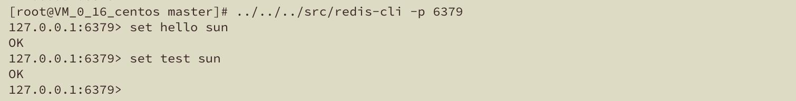

我们之前对Redis如何持久化数据做了一些了解；本文将与大家一同探讨一下Redis的主从复制；本文的演示环境如下：

* centos 7.0
* redis 5.0.4

#### 主从复制说明

在我们常见的Redis集群模式中普遍存在两种角色，其一是Master（支持数据的写入与读）取，另一种则是Slave（支持数据的读取）；Slave数据是Master数据的副本，那么数据是如何从Master复制到Slave节点的呢？

##### 复制方式

从复制的方式来讲，分为两种复制的方式，分别是Disk，Diskless：

* Disk传输过程：Redis Master 将创建一个新的进程在磁盘上写RDB文件，文件创建完成后，然后由父进程递增的传输文件跟副本节点。

* Diskless传输过程：Redis Master 将创建一个新的进程直接通过Socket将RDB文件传输给副本节点，相比Disk期间将不使用磁盘存储。

乍一看感觉Diskless还挺高端的，但是实际在选择复制方式的过程中还有以下要点要注意:

* 使用Disk方式，当RDB文件生成时，允许更多的副本节点排队；当子进程完成RDB文件创建，副本即可使用该RDB文件提供服务。

* 使用Diskless，开始向副本实例传输RDB文件，新增的副本节点将进入队列，必须等待当前传输任务的完成。


##### 复制数据量

从复制的数据量来讲：分为局部复制（partial），全量复制两种（full）；分别对应以下情形：

**全量复制**
* 当新增副本节点时，会进行全量复制，以保证数据的完整性
* 当副本节点与Master节点断开连接，并且断开的时间超过预设的缓冲区释放时间，导致缓存区释放后，则需要全量复制

**局部复制**
* 完成全量复制以后，增量的数据同步则使用局部复制。
* 与Master节点断开连接，当时没有超过预设的缓冲区释放时间，缓冲区没有释放，后续重新连接后仍可以使用局部复制。


#### 配置使用

Redis的配置文件对于各项配置的描述以及使用十分清楚，所以笔者很乐意与大家探讨配置使用的细节；关于复制的配置在redis.conf文件的 **REPLICATION** 这一章节。

##### 配置复制主节点

```
# 配置当前节点从某个节点配置数据，如下示例表示从127.0.0.1:6379复制
# replicaof 127.0.0.1 6379
replicaof <masterip> <masterport>
```

##### 配置主节点鉴权信息

```
# 若master配置了requirepass ,这里则需要设置
masterauth <master-password> 
```

##### 副本过期是否提供服务

```
# 副本去Master断开或者数据复制正在进行是否提供服务
# 设置为yes（默认），将继续提供服务，但数据可能是状态比较老旧
# 设置为no，将返回“SYNC with master in progress”
replica-serve-stale-data yes
```

##### 副本是否只读

```
# Redis2.6起，默认为yes
# 设置为yes，表示副本节点只提供只读服务
# 设置为no，表示副本可以提供写入服务，但是这样将造成节点的滥用
# 建议使用“rename”命令重命名
replica-read-only yes
```

##### 复制同步策略

```
# 两种策略，一种disk，一种diskless
# 设置为no（默认），表示使用disk
# 设置为yes（实验性），表示使用diskless
repl-diskless-sync no
```

##### Diskless延时配置

```
# 若同步方式选用：diskless；将默认设置5秒的延时；设置为0即可禁用，程序将尽可能快的开始传输；单位：秒；延时主要有如下两种目的：
# 1.等待创建子进程，用Socket的方式传输RDB文件
# 2.传输开始后，新连接的副本节点将进入等待队列；延迟可以等尽可能多的节点连接
repl-diskless-sync-delay 5
```

##### 副本心跳频率

```
# 副本节点发送PING的频率
# repl-ping-replica-period 10
```

##### 复制超时时间

```
# 为以下操作设置超时时间，单位：秒：
# 1.数据同步器件的传输时间
# 2. Master访问副本时间
# 3. 副本访问Master时间
# repl-timeout 60
```

##### 缓冲区大小设置

```
# 设置复制缓冲区大小
# 缓冲区设置越大，副本能够掉线依然允许使用局部复制的时间越长
# repl-backlog-size 1mb
```

##### 缓冲区释放时间

```
# 当Master与副本时间断开，超过一定的时间，将释放缓冲区；那么副本重连的时候将不支持局部复制，必须进行全部复制，设置为0，可以不释放缓冲区
# repl-backlog-ttl 3600
```

##### 副本有优先级

```
# 默认的优先级是100，数值越低优先级越高，0表示拒绝被选举
# 用于Redis Sentinel 集群中，当Master宕机以后，选举Slave成为Master的优先级
replica-priority 100
```

##### 最低副本限制

```
# min-replicas-to-write 用于设置最少的副本数量
# min-replicas-max-lag 用于设置最多落后时间，单位：秒
# 如下配置表示：有至少3个副本节点并且落后不能超过10秒，否则Master将拒绝新的写入，默认都是关闭的
# min-replicas-to-write 3
# min-replicas-max-lag 10
```

##### 声明副本IP+PORT

```
# 当存在端口转发或者NAT时使用，副本节点可能有多个IP地址，可以使用以下方法声明
# replica-announce-ip 5.5.5.5
# replica-announce-port 1234
```

#### 验证

通过上面的介绍，我们对主从复制有了一定的认识，接下来我们通过调试来一一验证。

**Master配置文件**
```
# 监听端口号
port 6379
# 是否后台运行
daemonize yes
# 日志级别
loglevel verbose
# 日志文件
logfile redis.log
# RDB、AOF文件目录
dir ./
# 副本复制策略
repl-diskless-sync no
# RDB文件名称
dbfilename master.rdb
```

**Slave01配置文件**
```
# 监听端口号
port 6380
# 是否后台运行
daemonize yes
# 日志级别
loglevel verbose
# 日志文件
logfile redis.log
# 设置副本主节点
replicaof 127.0.0.1 6379
```

##### 验证Disk全量复制

1.首先按照Master配置文件启动Master节点，并写入部分数据


2.按照Slave01配置文件启动Slave01节点，观察日志


3.Master输出日志，以及Master目录下文件


**Master创建子进程保存RDB文件，同步RDB文件给副本节点**

4.Slave01输出日志，以及Slave01目录下文件


**进行全量复制，接收RDB文件并加载**

##### 验证Disk局部复制

1.查看默认缓冲区大小以及缓冲区释放时间


2.断开Slave01节点，并在Master写入写数据


3.重新启动slave01节点，并关注Master和Slave01日志，**注意在缓冲区释放时间之内**


**我们发现在Slave01断开重新连接之后，只进行了局部复制**


##### 验证Diskless全量复制

注意修改Master配置文件中的repl-diskless-sync为yes
```
# 副本复制策略
repl-diskless-sync yes
```
1.首先按照新的Master配置文件启动Master节点，并写入部分数据
2.按照Slave01配置文件启动Slave01节点，观察Master日志


3.观察Slave01日志


我们发现Master没有额外创建RDB文件，Slave01接收成功后在其目录下有RDB文件，并且也是全量拷贝。

##### 验证Diskless局部复制

1.断开Slave01节点，并在Master写入写数据

2.3.重新启动slave01节点，并关注Master和Slave01日志，**注意在缓冲区释放时间之内**


**同样的在Slave01断开重新连接之后，只进行了局部复制**