#### 持久化简介

前文我们介绍了Redis集群的搭建并对Redis的一些配置有了基本的了解，本文将针对redis的持久化进行探究跟解读；如有疏漏之处还望，还望读者不吝赐教。本文的演示环境如下：

* centos 7.0 
* redis 5.0.4

数据持久化是为了防止redis宕机或者主机断电而造成数据丢失；目前redis提供了两种持久化策略，一种是RDB快照形式，另一种则是AOF文件形式；通过本篇文章您将了解RDB与AOF的相关配置、工作原理，以及使用方式。

#### RDB 持久化

Redis RDB的相关配置在redis.conf文件中SNAPSHOTTING这一章节，文件针对其的配置讲解也十分全面，我们先来了解一下。

##### RDB 配置解读

###### 设置保存快照频率
```
# save <seconds> <changes>
# save M N
# 表示M秒内，改变的keys超过N个则保存
save 900 1
save 300 10
save 60 10000
# 禁用配置，注释掉即可 # save 900 1
# 失效预先配置的值， save ""
```

###### 异步保存失败是否拒绝写
```
# 默认设置是yes，表示如果异步保存RDB文件失败，Redis将拒绝新的写入；
# 你也可以设置为no，即使保存RDB文件失败，Redis也能正常工作
# 例如：redis权限限制，则有可能发生写入失败
stop-writes-on-bgsave-error yes
```

###### 是否压缩RDB文件
```
# 默认设置是yes，表示RDB文件会进行压缩，但是压缩过程会额外消耗CPU
# 设置为no，则不会额外消耗CPU，但是需要更多磁盘空间
rdbcompression yes
```

###### RDB文件名称
```
# RBD的文件名称 dump.rdb
dbfilename dump.rdb
```

###### 持久化文件保存目录
```
# RDB文件与另一种方式产生的AOF文件都会保存在此目录下
dir ./
```
##### RDB 介绍

通过以上的配置，我们对其有了一个大概的了解;Redis可以用一定的频率存储RDB文件，而存储的是redis中的数据快照，并且为了节省磁盘空间它可以对文件进行压缩；还有就是在保存文件失败后，默认可以让redis拒绝新的写入请求。那么，它除了以上**配置SAVE**的方式，还有其他方式保存RDB文件么？这些方式是异步的还是同步的？

Redis RDB的保存提供了同步阻塞，以及异步非阻塞两类方式；
1. 客户端执行**SAVE**命令，此方式属于同步阻塞的方式；如若同步阻塞方式保存的快照文件过于庞大有可能会阻塞Redis，使其失去提供服务的能力。
2. 客户端执行**BGSAVE**命令，此方式属于异步非阻塞的方式，主进程会fork 一个子进程来执行快照的保存；
3. **配置文件SAVE**是异步的，这一点我也很意外；下面我们会进行验证

##### RDB 验证
以下为基础配置文件，验证不同项，会对配置文件稍作修改
```
# 监听端口
port 6379
# 每秒60个改变即保存快照
save 1 60
# RBD,AOF文件保存目录
dir ./
# RDB文件名
dbfilename redis.rdb
# 开启后台运行
daemonize yes
# 日志级别为全部收录
loglevel verbose
# 日志文件
logfile redis.log
```
###### 验证**SAVE**命令  

**SAVE**操作记录：
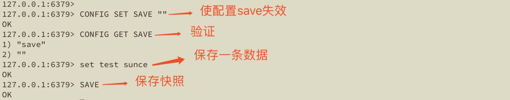

**SAVE**结果日志：


###### 验证**BGSAVE**命令

**BGSAVE**操作记录：
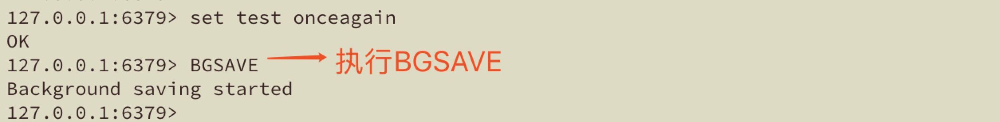

**BGSAVE**结果日志：
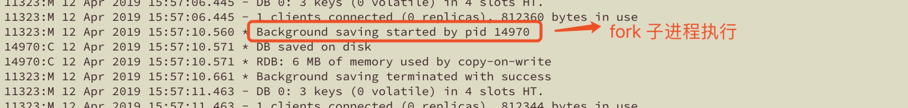

###### 验证**配置文件save**

**配置文件save**操作记录：
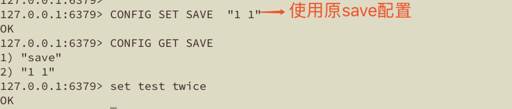

**配置文件save**结果日志：
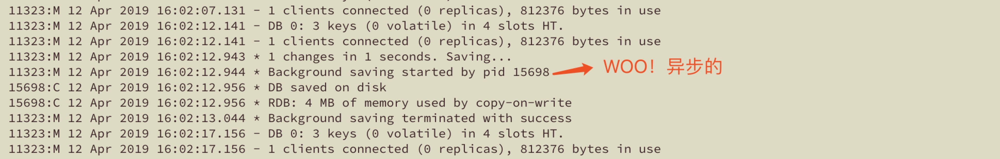

通过以上实验我们验证了SAVE命令同步保存，BGSAVE命令异步保存；配置文件SAVE也是异步的。那么紧接着我们来了解AOF的方式吧。

#### AOF 持久化

Redis AOF 的相关配置在redis.conf文件的APPEND ONLY MODE这一章节，我们一起看看都有哪些配置？

##### AOF 配置解读

###### 启用AOF模式
```
# 默认AOF模式是关闭的，启用设置为yes
appendonly no
```
###### AOF文件名称
```
# aof文件的名称，默认是appendonly.aof
appendfilename "appendonly.aof"
```
###### 内存数据写入磁盘频率
```
# 值选项：always/everysec/no
# 默认：everysec
# no：表示不主动写入磁盘，交由操作系统选择合适时机写入
# always：表示每次写操作结束后，理解写入磁盘；性能较低，但最安全
# everysec：表示每秒进行一次写入到磁盘，默认，推荐
appendfsync everysec
```
###### 重写操作时是否写入
```
# BGSAVE或者AOF后台重写将占用大量磁盘IO，当AOF的刷盘策略设置为always、everysec时，在一些Linux配置中Redis可能会阻塞很长时间在调用fsync(刷盘)调用；注意现在没有很好的解决办法，即使在一个新的线程中执行也将阻塞同步写的调用。
# 为了缓解这种问题，在执行BGSAVE或者BGREWRITEAOF时，避免fsync调用。这意味着在其他BGSAVE或者BGREWRITEAOF调用时，appendfsync配置相当于no；在实际应用中，最坏有可能丢失30秒数据。
# 如果你的应用对于延迟的要求比较高，可以设置为yes；否则还是建议设置为no。
no-appendfsync-on-rewrite no
```
###### 自动重写设置
```
# 自动重写是Redis会记录上次重写的大小，若当前文件的大小超过原来文件的一定比例，将进行自动重写；以示例说明：基础重写大小是64m，若当前aof文件大小是64m的2倍，将自动进行aof的重写。
# 自动重写比例设置
auto-aof-rewrite-percentage 100
# 自动重写最小大小
auto-aof-rewrite-min-size 64mb
```
###### 残缺AOF加载
```
# Redis宕机或者主机断电有可能导致AOF文件不完整；在重新启动Redis会检查AOF的完整性
# 此参数设置为yes，表示尽量尝试加载最多的文件
# 设置为no，将启动失败，需要用户使用"redis-check-aof"修复后，才可以启动
aof-load-truncated yes
```
###### 使用RDB文件作为头序
```
# RDB方式与AOF方式可以结合使用，5.0以后此参数默认为yes；
# 设置为yes，表示与RDB结合使用，AOF文件结构将由 |AOF| 变为 |RDB||AOF|
aof-use-rdb-preamble yes
```
##### AOF 介绍

AOF 是 Append Only File 的简称，顾名思义它采取的模式是将每次的写操作，通过配置的方式always、everysec、no来拼接在.aof文件中，像是Redis写入的日志；Redis可以通过自动重写的方式来方式AOF文件变得越来越大；同时它也可以将某个版本的RBD作为头序，来保存其后的写操作日志。

##### AOF 验证

以下文件作为基础配置文件，需要修改配置时，我们可以通过**CONFIG SET**来动态设置，使其生效。
```
# 监听端口
port 6379
# RBD,AOF文件保存目录
dir ./
# RDB文件名
dbfilename redis.rdb
# 开启后台运行
daemonize yes
# 日志级别为全部收录
loglevel verbose
# 日志文件
logfile redis.log
# 开启AOF
appendonly yes
# AOF文件名称
appendfilename "redis.aof"
# 刷盘频率 always、everysec、no
appendfsync everysec
```

###### 验证AOF数据格式

执行数据写入：
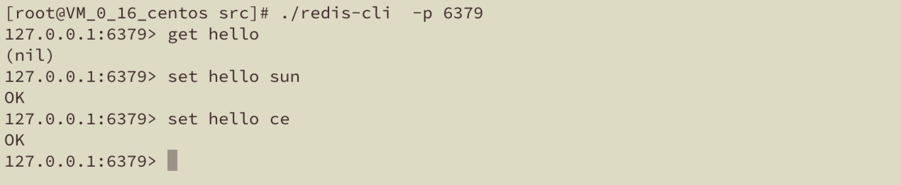
验证AOF文件内容：
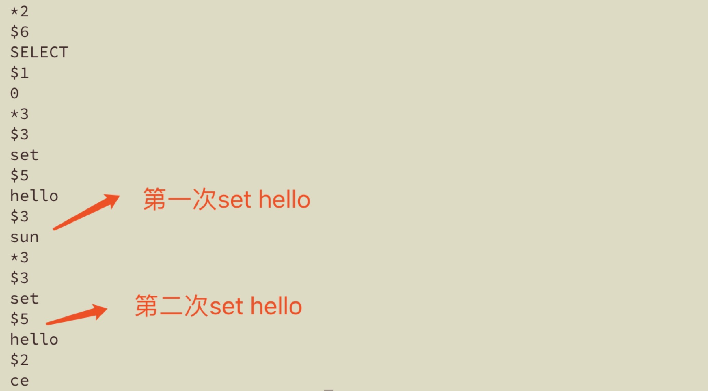

###### 验证AOF自动重写

为了方便验证，改变自动重写大小；
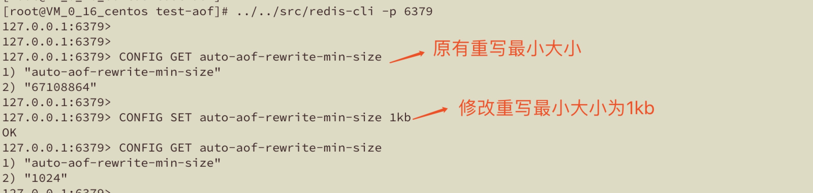

存入较大的value值，使其超过auto-aof-rewrite-min-size
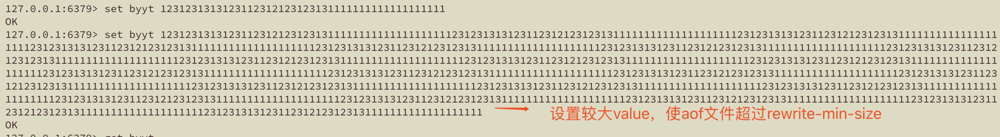

查看日志：
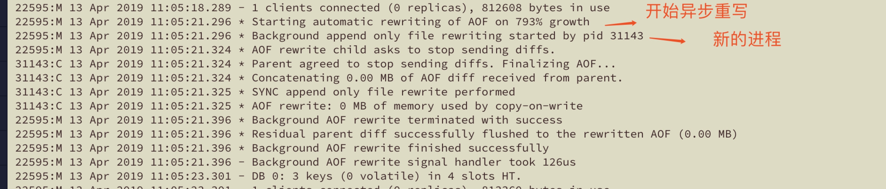
重写后文件大小：
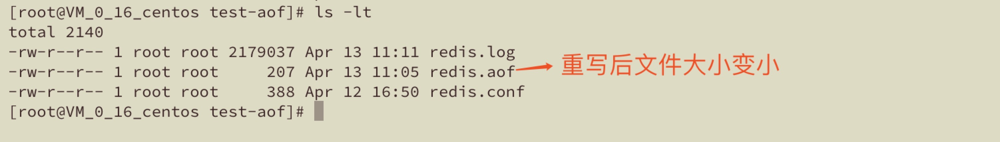

###### AOF文件内容对比
重写前：
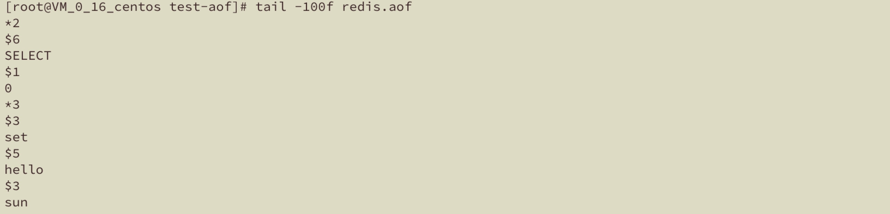

重写后：
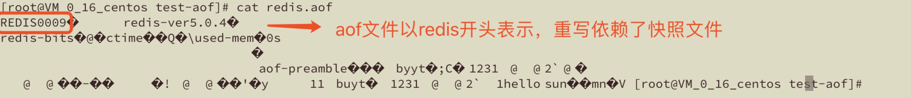

#### 总结

##### RDB与AOF对比

| 对比内容 | RDB | AOF | 解释 |
| --- | --- | --- | --- |
| 假若数据丢失 | 分钟级 | 秒级 | RDB依据save配置，AOF依据appendfsync配置 |
| 故障恢复优先级 | 低 | 高 | 故障恢复时优先读取AOF文件 |
| 故障恢复速度 | 快 | 慢 | RDB是依据内存数据快照来恢复，AOF是根据“写日志”恢复 |
| 数据完整性 | 低 | 高 | RDB是数据的某一个版本，AOF是数据的全量写入过程 |


##### 使用建议

* 两种方式结合使用，效果更优
* master节点尽量不要执行持久化操作，交由slave节点去执行
* 调优多参考官方配置，悉知各项配置利弊


#### 附录

配置详解以演示配置见：[https://github.com/sexylowrie/redis-teach](https://github.com/sexylowrie/redis-teach)