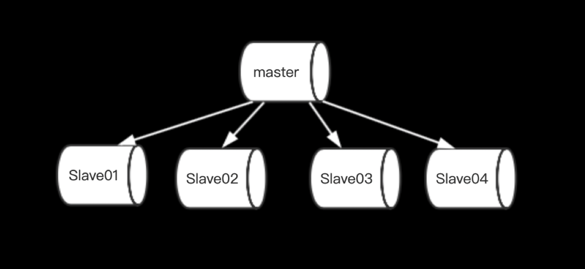
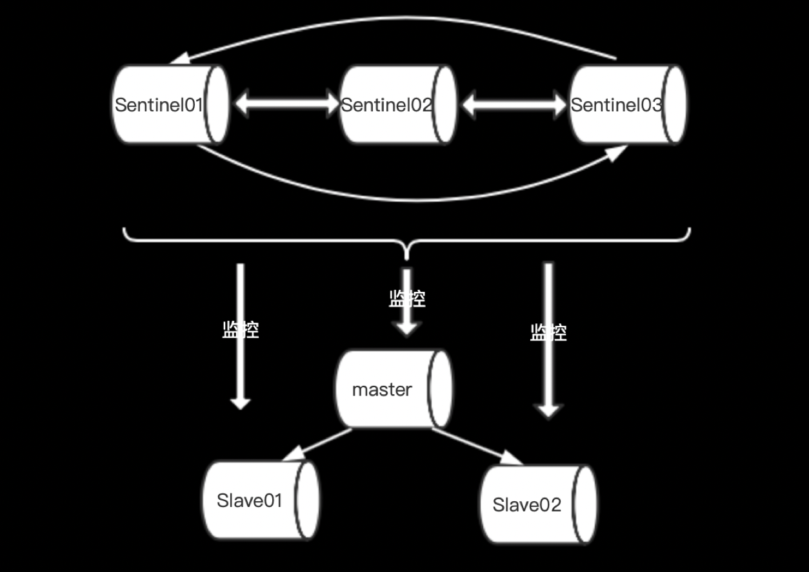

### Redis集群演进

在数据爆炸的信息时代，为了防止数据库被巨大的流量所击垮，人们开始缓存常用的“热数据”，以此减少对数据库的访问；而对于缓存的选型，redis则是深受人们青睐的佼佼者之一；为了保证redis在分布式环境中的高可用，目前我们常用的方式有有如下几种模式；下文会针对集群的搭建以及特性进行分析。

在介绍redis集群之前，我们先了解一下redis单实例的安装以及运用

#### redis [单实例]

* 编译安装的话需要提前安装gcc
```
$ wget http://download.redis.io/releases/redis-5.0.4.tar.gz
$ tar xzf redis-5.0.4.tar.gz
$ cd redis-5.0.4
$ make
```
* 编译完成后，随后运行redis-server
```
$ /src/redis-server
```
* 运行redis-cli
```
$ /src/redis-cli
127.0.0.1:6379> set hello world
OK
127.0.0.1:6379> get hello
"world"
```

#### redis [主从模式]

我们知道redis单实例没有办法保证缓存服务的高可用性；于是出现了主从模式来保证缓存的可用性；主从模式中，其中一个实例担任主节点，其余节点担任从节点；主节点支持数据的写入跟读取，从节点同步主节点数据并支持数据的读取。



演示部署方案：
```
# 创建目录redis-msterslave，用于保存主从模式配置
$ mkdir redis-msterslave
```
新增master.conf配置
```
port 6379
```
新增slave01.conf配置
```
port 6380
slaveof 127.0.0.1 6379
```
新增slave02.conf配置
```
port 6381
slaveof 127.0.0.1 6379
```

依次启动master，slave节点
```
./src/redis-server ./redis-masterslave master.conf

./src/redis-server ./redis-masterslave slave01.conf

./src/redis-server ./redis-masterslave slave02.conf

```

master主节点测试写入读取
```
$ ./src/redis-cli -p 6379
127.0.0.1:6379> set hello world
OK
127.0.0.1:6379> get hello
"world"
```

slave从节点测试读取写入
```
$ ./src/redis-cli -p 6380
127.0.0.1:6380> get hello
"world"
127.0.0.1:6380> set hello world2
(error) READONLY You can't write against a read only replica.
```

主从模式中的master存在单点问题，当master宕机后，没有办法进行故障转移，导致整个集群不同正常的提供服务。

#### redis sentinel [哨兵模式]

为了解决redis单实例的问题，以及实现redis集群的故障转移；redis在2.8版本以后支持sentinel[哨兵模式];这种模式中用三个角色，分别是：master，slave，sentinel；其作用如下：

**master**：负责数据的读取写入
**slave**：负责数据的读取
**sentinel**：负责监控集群，当master宕机以后，从剩余的slave节点中选举一个成为master



演示部署方案：
```
# 创建目录redis-sentinel，用于保存哨兵集群配置
$ mkdir redis-sentinel
```

新增master.conf为如下内容(演示集群，后续会有详细的配置文件说明)：
```
port 6379
```

新增slave01.conf;
```
port 6380
slaveof 127.0.0.1 6379
```

新增slave02.conf
```
port 6381
slaveof 127.0.0.1 6379
```

新增sentinel01.conf
```
port 26379
sentinel monitor mymaster 127.0.0.1 6379 2
```

新增sentinel02.conf
```
port 26380
sentinel monitor mymaster 127.0.0.1 6379 2
```

新增sentinel03.conf
```
port 26381
sentinel monitor mymaster 127.0.0.1 6379 2
```

其中：mymaster 为集群名称 ；127.0.0.1 6379 为主节点地址；2 为投票成员数量

依次启动master，slave，sentinel

```
./src/redis-server .s/redis-sentinel/master.conf

./src/redis-server ./redis-sentinel/slave01.conf

./src/redis-server ./redis-sentinel/slave02.conf

./src/redis-server ./redis-sentinel/sentinel01.conf --sentinel

./src/redis-server ./redis-sentinel/sentinel02.conf --sentinel

./src/redis-server ./redis-sentinel/sentinel03.conf --sentinel
```

启动客户端验证

根据集群名称从哨兵集群获取主节点地址
```
$ ./src/redis-cli -p 26379
127.0.0.1:26379> sentinel get-master-addr-by-name mymaster
1) "127.0.0.1"
2) "6379"
```

查看当前节点角色
```
$ ./src/redis-cli -p 6379
127.0.0.1:6379> info replication
role:master
connected_slaves:2
slave0:ip=127.0.0.1,port=6380,state=online,offset=45616,lag=1
slave1:ip=127.0.0.1,port=6381,state=online,offset=45616,lag=1
master_repl_offset:45616
repl_backlog_active:1
repl_backlog_size:1048576
repl_backlog_first_byte_offset:2
repl_backlog_histlen:45615
```

我们发现6379节点有两个从节点，那么我们对主节点停用，检查能否进行故障转移呢？
```
127.0.0.1:6379> shutdown save
```

查看6380节点的角色
```
$ ./src/redis-cli -p 6380
127.0.0.1:6380> info replication
# Replication
role:slave
master_host:127.0.0.1
master_port:6381
master_link_status:up
master_last_io_seconds_ago:0
master_sync_in_progress:0
slave_repl_offset:2846344
slave_priority:100
slave_read_only:1
connected_slaves:0
master_replid:d5f4ba1c6a2793478e5ea2bec07345c1f272068a
master_replid2:b44a368d0903b6ec965c340ce79bf8f8ba5c05ab
master_repl_offset:2846344
second_repl_offset:2844327
repl_backlog_active:1
repl_backlog_size:1048576
repl_backlog_first_byte_offset:1797769
repl_backlog_histlen:1048576
```

我们发现6380变成了6381节点的slave；即完成了对6379的故障转移；我们重新启动6379节点，查看该节点的角色
```
$ ./src/redis-cli -p 6379
127.0.0.1:6379> info replication
# Replication
role:slave
master_host:127.0.0.1
master_port:6381
master_link_status:up
master_last_io_seconds_ago:0
master_sync_in_progress:0
slave_repl_offset:2897404
slave_priority:100
slave_read_only:1
connected_slaves:0
master_replid:d5f4ba1c6a2793478e5ea2bec07345c1f272068a
master_replid2:0000000000000000000000000000000000000000
master_repl_offset:2897404
second_repl_offset:-1
repl_backlog_active:1
repl_backlog_size:1048576
repl_backlog_first_byte_offset:2894974
repl_backlog_histlen:2431
```

从故障中恢复的6379节点重新以slave的身份加入集群。

这样的集群配置就真的万无一失了么？

#### redis cluster [集群模式]

通过搭建redis-sentinel集群，我们了解到可以对master节点进行故障转移；但是如遇网络抖动，master节点下线，新选举的slave节点并没有成功晋升为master，那么整个集群就会出去无主的状态，进而出现“脑裂”，导致整个集群失去写入能力；

哨兵集群中master还是存在单点问题，为了能够缓解master的压力，实现主节点的分布式部署以及负载均衡；redis3.0之后支持redis-cluster[集群模式]，集群总共定义了16384个槽位，数据通过哈希一致性算法，均匀的分布在集群的主节点上；例如现有3主3从的集群，master-A上分布着0~5460，master-B上分布着5461~10922，master-C上分布着10923~16383；而slave-A，slave-B，slave-C 分别使其主节点的副本，当某个主节点下线以后，其对应的从节点晋升成为主节点；进而保证数据的完整性。

集群部署方案一：

我们可以利用redis下面的/utils/create-cluster来创建集群,它默认会创建三主三从的集群

```
$ cd /redis-5.0.4/utils/create-cluster
$ ./create-cluster start
$ ./create-cluster create
....

$ ./create-cluster stop
```
create-cluster start 会启动集群节点，这时所有节点都是主节点
create-cluster create 完成主从关系分配和数据槽位的分配
create-cluster stop 集群停止

集群部署方案二：

使用redis-trib.rb来创建管理集群，**依赖Ruby环境**

创建redis-cluster目录用于存储配置文件
```
$ mkdir redis-cluster
```

节点的redis-n.conf基础配置文件
```
port 7000
cluster-enabled yes
cluster-config-file nodes-7000.conf
cluster-node-timeout 5000
appendonly yes
```

集群的运行至少需要3个主节点，我们创建对应的配置文件，修改以上配置文件的端口即可，如下
```
port 7001
cluster-enabled yes
cluster-config-file nodes-7001.conf
cluster-node-timeout 5000
appendonly yes
```
分别是redis-7000.conf，redis-7001.conf，redis-7002.conf，redis-7003.conf，redis-7004.conf，redis-7005.conf共计6个配置文件。

分别启动6个redis-server

```
../../src/redis-server ./redis-7000.conf

../../src/redis-server ./redis-7001.conf

../../src/redis-server ./redis-7002.conf

../../src/redis-server ./redis-7003.conf

../../src/redis-server ./redis-7004.conf

../../src/redis-server ./redis-7005.conf

```

随后使用redis-trib.rb来管理集群

```
../../src/redis-trib.rb create --replicas 1 127.0.0.1:7000 127.0.0.1:7001 127.0.0.1:7002 127.0.0.1:7003 127.0.0.1:7004 127.0.0.1:7005
```
--replicas 1 表示我们希望给每个主节点创建一个从节点

集群创建成功会输出
```
[OK] All 16384 slots covered
```
